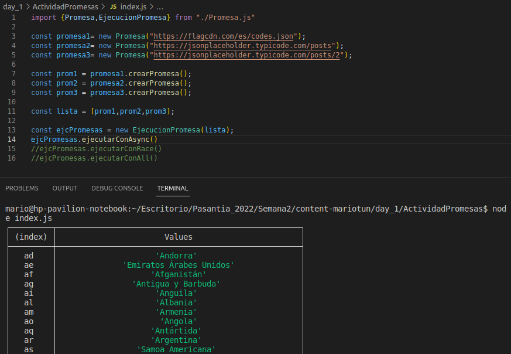
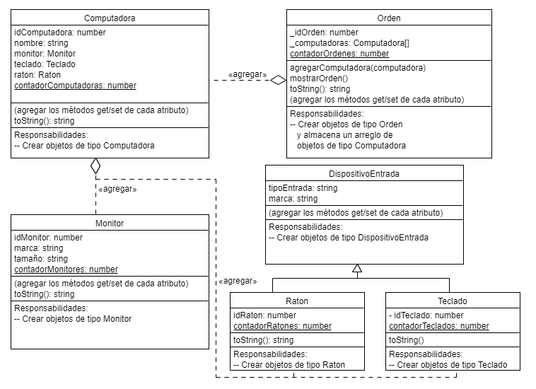
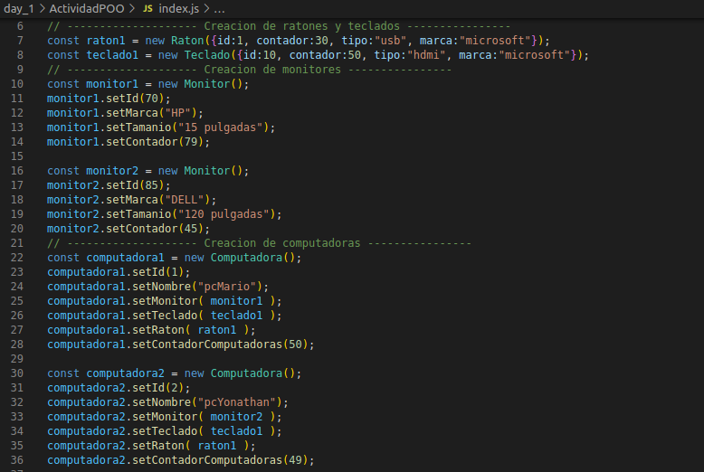
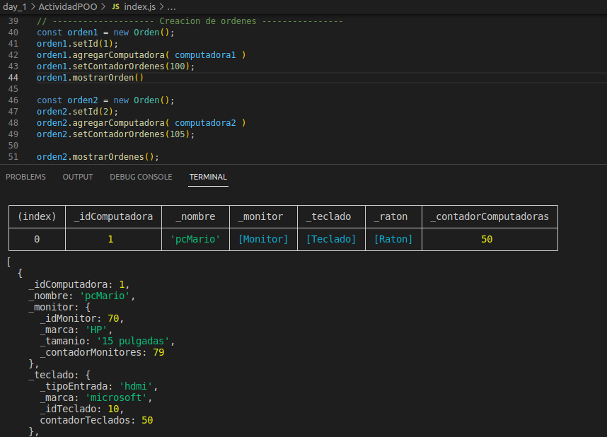
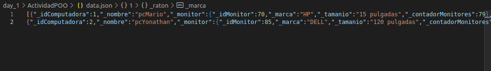

## **Actividad Promesas**
---
**Promesas**

- Crear una promesa por cada endpoint.
- Ejecutar todas las promesas de forma:
    - asincrona
    - promise.all
    - promise.race
- Endpoints
    - obtner codigos de banderas
    https://flagcdn.com/es/codes.json
    - obtener todos los posts
    https://jsonplaceholder.typicode.com/posts
    - obtener un post
    https://jsonplaceholder.typicode.com/posts/2

**Ejecucion de las promesas segun la forma elegida**

 
 

## **Actividad POO**
---

**De acuerdo al diagrama realice.**

- Crear cada uno de las entidades.
- Aplicar los pilares de Programacion Orientada a Objetos.
- Persistir los registros de orden en un archivo Json.
- Aplicacion consola.

**Creacion de objetos para una orden**

**Creacion de una orden y sus resultados**

**Persistencia de las ordenes en el archivo data.json**
